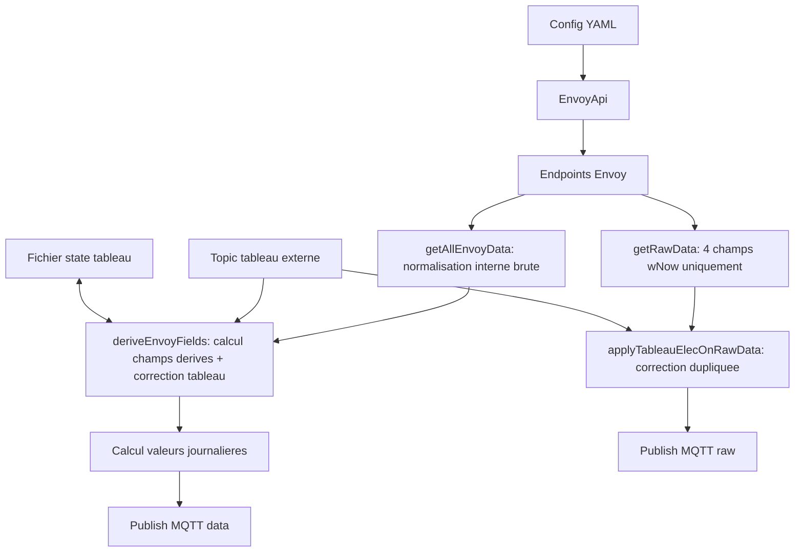

# Pipeline de donnees Envoy

Ce document decrit le flux complet de donnees dans ce projet:

- authentification Enphase
- appels HTTP a la passerelle Envoy
- normalisation et calculs
- integration du tableau electrique deporte via MQTT
- publication MQTT en mode normal et mode haute frequence

## 1. Vue d ensemble

Le service principal lance deux boucles:

- boucle full: lecture complete + calculs + publication retained
- boucle raw (optionnelle): lecture puissance instantanee + publication rapide non retained



Depuis la refonte, `EnvoyApi.getAllEnvoyData()` ne fait plus que la normalisation brute (renommage de champs, aucun calcul croise). Tous les champs derives (grid, eco, courant, lifetimes corriges) sont calcules en un seul passage par `deriveEnvoyFields()` (src/envoyDerivedFields.js), que le tableau elec soit actif ou non (avec une correction nulle par defaut).

**Attention, chemin separe pour le raw**: la boucle raw n'utilise ni `getAllEnvoyData()` ni `deriveEnvoyFields()`. Elle appelle `EnvoyApi.getRawData()` (src/envoyApi.js:365), une methode distincte qui ne recupere que 4 champs (`conso_all_wNow`, `conso_net_wNow`, `prod_wNow`, `timestamp`), puis `applyTableauElecOnRawData()` (src/mqttService.js:501), qui **duplique** — dans son propre code, separement — la meme correction `+= signedPowerW` que `deriveEnvoyFields()` applique de son cote pour le flux complet. Les deux chemins arrivent au meme resultat pour les champs wNow communs, mais via deux implementations distinctes a maintenir en parallele.

## 2. Authentification et securite

Le projet utilise un token bearer Enphase pour les endpoints Envoy.

Sequence:

1. POST https://enlighten.enphaseenergy.com/login/login.json
2. POST https://entrez.enphaseenergy.com/tokens
3. GET /auth/check_jwt sur l Envoy local
4. Reauth automatique si 401

Points importants:

- token considere valide pendant 12h
- timeout cloud: max(8000ms, timeout local)
- timeout local Envoy: config http.timeout_ms
- option insecure TLS possible (certificat auto-signe)
- les requetes Envoy independantes (meters/readings, consumption, production v1) sont lancees en parallele (`Promise.all`) plutot que sequentiellement — voir 3.x. `ensureAuthenticated()` (src/envoyApi.js:67) garantit qu'une seule authentification est en vol a la fois meme si plusieurs requetes paralleles detectent un token invalide simultanement (single-flight): les appels concurrents attendent la meme promesse au lieu de relancer chacun un login.
- `ensureAuthenticated()` applique aussi un backoff exponentiel plafonné (`EnvoyApi.AUTH_BACKOFF_BASE_MS` 30s → `AUTH_BACKOFF_MAX_MS` 30min) sur les echecs de login consecutifs: pendant la fenetre de backoff, toute tentative echoue immediatement en local (aucun appel reseau) au lieu de retenter un login vers Enphase. Sans ca, un identifiant revoque ou une panne cloud ferait retenter un login a chaque cycle — jusqu'a plusieurs fois par seconde en mode haute frequence. Un succes reinitialise le compteur d'echecs et le backoff.
- l'Envoy est un device embarqué qui pourrait ne pas gerer 3 requetes concurrentes aussi bien qu'un serveur classique (traitement interne serialisé, timeouts). `getMetersReadings()`, `getRawData()` et `getAllEnvoyData()` logguent chacun leur duree totale en `debug` (`"... terminé (parallèle)"`, avec `durationMs`) — a surveiller en conditions reelles (`LOG_LEVEL=debug`) pour confirmer que le parallelisme aide reellement et ne provoque pas de timeouts/erreurs qui n'existaient pas avant.

Reference code:

- src/envoyApi.js:1

## 3. Endpoints utilises et formats de retour

### 3.1 GET /ivp/meters

But: recuperer la liste des compteurs et associer eid -> type de mesure.

Le code filtre sur:

- production
- net-consumption

Exemple de retour (simplifie):

```json
[
	{ "eid": 704643328, "measurementType": "production" },
	{ "eid": 704643584, "measurementType": "net-consumption" }
]
```

Resultat interne:

```json
{
	"704643328": "production",
	"704643584": "net-consumption"
}
```

Ce mapping est mis en cache en memoire avec un TTL (`EnvoyApi.METERS_INFO_CACHE_TTL_MS`, 6h par defaut) plutot que cache indefiniment: si l'Envoy reassigne un jour ses eids (firmware, ajout/retrait d'une pince), le service se corrige tout seul en quelques heures sans necessiter de redemarrage manuel. `clearCache()` permet aussi de forcer un rafraichissement immediat. Le TTL evite de resolliciter l'Envoy a chaque cycle (l'appel `/ivp/meters` reste rare), important pour la boucle haute frequence.

Reference code:

- src/envoyApi.js:294 (getMetersInfo)

### 3.2 GET /ivp/meters/readings

But: recuperer les mesures instantanees et cumulees de chaque compteur.

Exemple de retour Envoy (simplifie):

```json
[
	{
		"eid": 704643328,
		"instantaneousDemand": 1260,
		"voltage": 236.2,
		"current": 5.4,
		"pwrFactor": 0.98,
		"actEnergyDlvd": 5581234
	},
	{
		"eid": 704643584,
		"instantaneousDemand": -420,
		"voltage": 235.8,
		"current": -1.8,
		"pwrFactor": -0.94,
		"actEnergyRcvd": 2334455,
		"actEnergyDlvd": 1234567
	}
]
```

Resultat interne apres mapping par role:

```json
{
	"production": { "...": "..." },
	"net-consumption": { "...": "..." }
}
```

Reference code:

- src/envoyApi.js:319 (getMetersReadings)

### 3.3 GET /ivp/meters/reports/consumption

But: recuperer les cumuls de consommation (total/net).

Exemple de retour Envoy (simplifie):

```json
[
	{
		"reportType": "total-consumption",
		"cumulative": {
			"currW": 1860,
			"rmsCurrent": 8.2,
			"rmsVoltage": 236.0,
			"whDlvdCum": 9123456
		}
	},
	{
		"reportType": "net-consumption",
		"cumulative": {
			"whDlvdCum": 6789012
		}
	}
]
```

Resultat interne:

```json
{
	"total-consumption": { "currW": 1860, "rmsCurrent": 8.2, "rmsVoltage": 236.0, "whDlvdCum": 9123456 },
	"net-consumption": { "whDlvdCum": 6789012 }
}
```

Reference code:

- src/envoyApi.js:343 (getConsumptionReports)

### 3.4 GET /api/v1/production

But: recuperer notamment wattHoursToday.

Exemple de retour utile:

```json
{
	"wattHoursToday": 12450
}
```

Reference code:

- src/envoyApi.js:360 (getProductionV1)

### 3.5 Glossaire des champs bruts (API Envoy)

Definitions telles que documentees par l'API Envoy (endpoints ci-dessus), avant tout renommage/calcul par le programme:

- **eid**: identifiant unique d'un compteur (CT) cote Envoy. Sert a associer une lecture de `/ivp/meters/readings` a son role via le mapping `eid -> measurementType` recupere sur `/ivp/meters`.
- **measurementType**: role d'un compteur retourne par `/ivp/meters` (`production`, `net-consumption`, `total-consumption`, ...). Le programme ne retient que `production` et `net-consumption` pour `/ivp/meters/readings` (voir 3.1).
- **reportType**: equivalent de `measurementType` mais pour `/ivp/meters/reports/consumption` (`total-consumption` ou `net-consumption`).
- **instantaneousDemand**: puissance instantanee mesuree par le compteur (W). Pour le compteur bidirectionnel `net-consumption`: negative quand le foyer exporte plus qu'il n'importe a l'instant T, positive quand il importe net.
- **voltage** / **current** / **pwrFactor**: tension (V), courant (A) et facteur de puissance instantanes mesures par le compteur, sur `/ivp/meters/readings`.
- **actEnergyDlvd** ("The active energy delivered on this channel"): energie active cumulee **delivree** par ce canal depuis la mise en service. Sur le compteur `production`: production totale (lifetime), point de vue des panneaux — sans ambiguite. Sur le compteur `net-consumption`, ces deux champs sont definis du point de vue du **reseau** (pas de la maison): `actEnergyDlvd` = energie delivree **par le reseau** (donc **import**). Confirme empiriquement (voir 9.4): valeur proche de l'"Importe" lifetime affiche par Enlighten.
- **actEnergyRcvd** ("The active energy received on this channel"): sur le compteur `net-consumption`, energie **recue par le reseau** (donc **export**). Confirme empiriquement: valeur proche de l'"Exporte" lifetime affiche par Enlighten. Attention, ce n'est pas le sens intuitif "recu/delivre par la maison" — c'est bien le reseau qui est le sujet de ces deux verbes ici.
- **currW** / **rmsCurrent** / **rmsVoltage**: puissance instantanee (W) et valeurs RMS de courant/tension, retournees par `/ivp/meters/reports/consumption` (endpoint distinct de `/ivp/meters/readings`, dedie aux rapports de consommation).
- **whDlvdCum**: cumul d'energie "delivree" (Wh) tel que retourne par `/ivp/meters/reports/consumption`. Pour `total-consumption`: consommation totale du foyer (tous circuits vus par l'Envoy). Pour `net-consumption`: solde net cumule, qui peut **monter et descendre** selon la balance production/consommation du moment (voir 6.3 et 9).
- **wattHoursToday**: energie produite depuis minuit (Wh) telle que calculee par l'Envoy lui-meme, sur `/api/v1/production`. Republiee telle quelle en `prod/wattHoursToday`, non utilisee pour le calcul interne de `*_today` (voir 5.2, qui recalcule sa propre valeur depuis les references `_00h`).

## 4. Objets de sortie internes

### 4.1 Sortie getRawData

Objet compact pour la boucle haute frequence:

```json
{
	"conso_all_wNow": 1860,
	"conso_net_wNow": -420,
	"prod_wNow": 1260,
	"timestamp": 1720000000
}
```

Reference code:

- src/envoyApi.js:365 (getRawData)

**Champ additionnel non present dans getRawData()**: `publishRawLoop` (src/mqttService.js:436) ajoute un 5e champ, `conso_net_energy_flow`, avant publication — il ne vient pas de l'Envoy mais du dernier `energy_flow` connu du capteur general (`this.generalMeter.state.energyFlow`, voir 8.3). Il n'apparait qu'une fois qu'au moins un message du capteur general a ete recu; absent avant ca.

### 4.2 Sortie getAllEnvoyData

Objet brut normalise pour la boucle principale (renommage de champs uniquement, aucun calcul croise):

- puissances instantanees telles que renvoyees par l'Envoy
- tensions/courants/facteur de puissance
- compteurs lifetime Wh
- timestamp et timestamp_text

Aucun champ kWh n'est produit ici (ni nulle part ailleurs dans le pipeline, voir 6.3 "Champs kWh"): seul le Wh est calcule/publie, le kWh n'existant qu'a l'affichage Home Assistant.

Exemples de champs produits:

- prod/wNow
- conso_net/wNow
- conso_all/wNow
- prod/whLifetime
- conso_net/whLifetime
- conso_all/whLifetime

Note: `grid/wNow`, `grid/wNow_binary`, `eco/wNow` et `conso_net/current` ne font plus partie de cette sortie brute — ils sont calcules par `deriveEnvoyFields()` (voir 4.3), en un seul passage, a partir de cet objet.

Reference code:

- src/envoyApi.js:385

### 4.3 Sortie deriveEnvoyFields

Fonction pure (src/envoyDerivedFields.js) qui prend l'objet brut de `getAllEnvoyData()` plus une correction optionnelle `{ signedPowerW, energyOffsetWh }` (nulle par defaut) et renvoie l'objet final publie, en un seul passage de calcul:

- champs bruts recopies tels quels
- conso_net/wNow / conso_all/wNow decales de `signedPowerW`
- grid/wNow, grid/wNow_binary, eco/wNow calcules a partir du net corrige
- conso_net/current recalcule via I = P / U
- conso_net/whLifetime et conso_all/whLifetime decales de `energyOffsetWh`
- grid/whLifetime et eco/whLifetime deduits par conservation d'energie — plus de clamp/monotonie a gerer ici, contrairement a l'ancienne approche basee sur le TOR (retiree, voir historique 6.3)
- aucun champ `*_kwhLifetime` n'est produit: le kWh n'est jamais publie comme champ MQTT separe, voir 6.3 "Champs kWh"

Reference code:

- src/envoyDerivedFields.js:6

## 5. Logique de calcul metier

### 5.1 Calculs derives de base

A partir de la puissance nette corrigee (`correctedNetPowerW`, apres application de la correction tableau elec):

- grid/wNow = abs(correctedNetPowerW) si correctedNetPowerW < 0 sinon 0
- grid/wNow_binary = 1 si correctedNetPowerW > 0 sinon 0
- eco/wNow = prodDemand + correctedNetPowerW si correctedNetPowerW < 0 sinon prodDemand

Ces trois champs restent bases sur le TOR. Le cumul lifetime (`grid/whLifetime`, `eco/whLifetime`), lui, est calcule par conservation d'energie — voir 6.4.

Ce calcul tourne desormais systematiquement dans `deriveEnvoyFields()`, tableau elec actif ou non (correction nulle dans ce dernier cas — voir 6.3).

Reference code:

- src/envoyDerivedFields.js:6

### 5.2 Valeurs journalieres

Le service maintient une reference minuit pour:

- conso_all/whLifetime
- conso_net/whLifetime
- prod/whLifetime
- import/whLifetime
- eco/whLifetime
- grid/whLifetime

Et publie:

- sensor_today = current_lifetime - reference_00h
- sensor_yesterday lors du passage a minuit

#### Detection du changement de jour

`checkAndUpdateMidnightReferences()` ne s'appuie plus sur une fenetre d'horloge fixe (ex: "entre 00h00 et 00h05"). Elle compare simplement la date courante (`getNowPartsInTz().date`) a la derniere date traitee (`this.lastMidnightCheck`) — des que la date differe, le rollover se declenche, quelle que soit l'heure exacte. Cette approche est independante de `polling.interval_ms` : avec l'ancienne fenetre fixe, un intervalle de polling superieur a quelques minutes pouvait faire rater completement le passage a minuit un jour donne (le rollover n'aurait alors plus jamais lieu ce jour-la). Avec la detection par changement de date, le rollover se declenche systematiquement des la premiere iteration de boucle qui observe un nouveau jour — seule sa **precision** depend de la frequence de polling (avec un intervalle tres long, la reference _00h/_yesterday est capturee plus tard dans la journee que minuit exact, mais elle finit toujours par etre capturee).

Le tout premier appel apres le demarrage du service memorise simplement le jour courant sans declencher de rollover (sinon un demarrage en milieu de journee serait pris a tort pour un changement de jour).

#### Snapshot utilise pour cloturer yesterday et reamorcer _00h

Detecter le changement de jour ne suffit pas: encore faut-il cloturer `yesterday` et reamorcer `_00h` a partir d'une valeur representative de minuit reel, pas de la donnee live au moment (potentiellement tardif) ou le tick detecte le changement. Utiliser directement `currentData` pour les deux ferait perdre silencieusement la conso ecoulee entre minuit et cet instant: elle serait comptee dans `yesterday` (surcompte) puis jamais recomptee dans `today`, puisque le nouveau `_00h` repartirait de cette meme valeur deja gonflee.

`checkAndUpdateMidnightReferences()` utilise donc `this.previousFullData ?? currentData` (`rolloverSnapshot`) pour les deux etapes du rollover — le meme instant sert a cloturer `yesterday` et a reamorcer `_00h`, rien n'est perdu ni double-compte:

- `this.previousFullData` est le dernier relevé complet du tick precedent, mis a jour a chaque iteration de `publishFullLoop()` (juste apres l'appel a `checkAndUpdateMidnightReferences`) — en usage normal (service qui tourne en continu), c'est une bien meilleure approximation de "minuit reel" que la donnee du tick qui detecte effectivement le changement, avec une precision bornee par `polling.interval_ms`.
- A defaut (RAM neuve: redemarrage du service a cheval sur minuit, ou tout premier tick apres un demarrage qui detecte immediatement un changement de jour), repli sur `currentData` — comportement historique, degrade mais fonctionnel, borne par la duree de la coupure plutot que par `polling.interval_ms`. Corriger ce cas residuel demanderait de persister en continu les relevés bruts sur disque (jugé hors scope pour ce projet).

`this.previousFullData` n'est jamais persisté sur disque (RAM uniquement) — il n'a pas besoin de survivre a un redemarrage, le repli sur `currentData` couvrant deja ce cas.

#### Persistance de `midnightReferences` et `lastMidnightCheck`

Les references `_00h` et `this.lastMidnightCheck` (dernier jour pour lequel le rollover a ete effectue) sont persistees dans un fichier JSON local (`state.midnight_references_file`, defaut `data/midnight-references-state.json`), ecrit directement (sans etape intermediaire) a chaque changement via `saveMidnightReferencesToDisk()`, et relu de facon synchrone au demarrage via `loadMidnightReferencesFromDisk()` — avant meme la premiere lecture Envoy.

Ces valeurs restent egalement publiees en `retain: true` sur MQTT (`topicData/<sensor>_00h`, `topicData/last_midnight_check`) pour rester visibles/debuggables depuis un client MQTT ou Home Assistant, mais ce ne sont plus des topics utilises pour la restauration au demarrage: attendre une redelivrance de messages retained (le service dormait auparavant 10s apres la connexion MQTT pour ca, cf. historique) rendait la restauration fragile et compliquee a corriger manuellement (il fallait republier un message pour corriger une reference). Le fichier local est desormais la seule source de verite au demarrage, et peut se corriger avec un simple editeur de texte.

**Format du fichier**: pour rester lisible/editable a la main, le JSON sur disque regroupe les references par nom court de capteur, sous deux cles `index_00h` (reference `_00h`, un index absolu) et `conso_yesterday` (quantite consommee la veille) — plutot que le format interne a plat (`midnightReferences["conso_all/whLifetime"]`/`midnightReferences["conso_all/yesterday"]`) utilisé en memoire par le reste du code (`dailySensors`, `calculateDailyValues`, topics MQTT). La conversion entre les deux formes se fait uniquement dans `loadMidnightReferencesFromDisk()`/`saveMidnightReferencesToDisk()` — le reste du code ne voit jamais le format disque.

```json
{
  "midnightReferences": {
    "index_00h": {
      "conso_all": 235346,
      "conso_net": 151580,
      "eco": 76366,
      "prod": 12801174.374,
      "to_grid": 7400
    },
    "conso_yesterday": {
      "conso_all": 207491,
      "conso_net": 132930,
      "prod": 74562,
      "eco": 69261,
      "to_grid": 4420
    }
  },
  "lastMidnightCheck": "2026-07-31"
}
```

Sans cette persistance, un redemarrage du service tombant pile sur un changement de jour (arret avant minuit, redemarrage apres) ferait perdre le rollover `_yesterday` de ce jour precis: au redemarrage `lastMidnightCheck` serait `undefined`, et le premier appel se contenterait de memoriser le nouveau jour sans jamais calculer `_yesterday` pour le jour manque.

Reference code:

- src/mqttService.js:603 (initializeMissingReferences)
- src/mqttService.js:619 (checkAndUpdateMidnightReferences — persistance + publication retained)
- src/mqttService.js:850 (calculateDailyValues)
- src/mqttService.js:184 / :235 (loadMidnightReferencesFromDisk / saveMidnightReferencesToDisk)

#### Tester le rollover a toute heure (environnement de test)

`lastMidnightCheck` n'etant relu depuis le disque qu'au demarrage du service, on peut forcer un rollover au prochain tick sans attendre minuit reel, quelle que soit l'heure courante:

1. Arreter le service (ou editer avant le tout premier demarrage).
2. `make simulate-midnight-rollover` (ou directement `scripts/simulate-midnight-rollover.sh [chemin_fichier_etat]`) — recule `lastMidnightCheck` d'un jour dans le fichier d'etat (`data/midnight-references-state.json` par defaut), sans toucher a `midnightReferences`.
3. Redemarrer le service. Au prochain tick de `publishFullLoop()` (`polling.interval_ms`), `checkAndUpdateMidnightReferences()` detecte l'ecart de date et declenche un vrai rollover avec les donnees live du moment.
4. Verifier sur MQTT (`data/*_yesterday`, `data/*_00h`, `data/last_midnight_check`, tous retained) que les valeurs se mettent a jour.

**Limite** : `this.previousFullData` etant en RAM (jamais persisté), un service qui vient de redemarrer repart toujours sans lui — cette procedure exerce donc le chemin de repli (`currentData`) decrit ci-dessus, pas le chemin precis (`previousFullData`). Le chemin precis est couvert par `tests/midnightRollover.test.js` (test avec `service.previousFullData` positionné directement), pas par ce test manuel.

## 6. Integration du tableau electrique deporte

### 6.0 Topologie physique de l'installation

Points cles de cette topologie (voir aussi 6.3 et 9.4):

- Le sensor de **production** Envoy est place directement apres les panneaux: il mesure toute la production solaire, sans exception — fiable, jamais besoin de correction.
- Le sensor **net-consumption** Envoy (TOR) est place entre la maison et le reseau: il voit tout ce que la maison importe/exporte, mais **pas** ce qui se passe sur le tableau ext (aveugle a cette branche, comme s'il n'existait pas).
- Le **tableau ext** a son propre sensor (puissance + index cumule), place en amont de la borne de recharge voiture. Il peut consommer du solaire (branche sur le meme bus de production, avant le sensor net-consumption) aussi bien que du reseau, sans que ni le sensor de production ni le sensor net-consumption ne le voient directement. Il ne fait que consommer/importer, jamais exporter.
- Consequence pratique: la consommation du tableau ext (`tableau_ext/whOffset`, alias `energyOffsetWh`) doit etre reintegree manuellement dans les calculs bases sur le TOR (conso, voir 6.3/9.4).

Configuration:

- sensors.tableau_elec.topic
- sensors.tableau_elec.power_field
- sensors.tableau_elec.index_field
- sensors.tableau_elec.index_unit: kwh | wh | auto
- sensors.tableau_elec.sign: 1 ou -1
- sensors.tableau_elec.state_file

### 6.1 Format de payload accepte

Exemple type Zigbee2MQTT:

```json
{
	"power": 7200,
	"energy": 1345.231
}
```

Regles:

- power_field alimente la correction instantanee (W)
- index_field alimente la correction energie (differentiel d index)
- la premiere valeur d index est baseline, jamais ajoutee telle quelle

### 6.2 Persistance entre redemarrages

Le fichier state_file (par defaut data/tableau-elec-state.json) stocke:

```json
{
	"version": 2,
	"updatedAt": "2026-07-19T12:34:56.000Z",
	"lastIndexWh": 1345231,
	"energyFromIndexWh": 5420,
	"pendingResetIndexWh": null,
	"pendingResetLastSeenWh": null,
	"pendingResetCount": 0
}
```

`lastIndexWh`/`energyFromIndexWh` sont la derniere valeur confirmee et l'offset cumule. Les trois champs `pendingReset*` portent l'etat de la fenetre de confirmation d'un eventuel reset/remplacement de capteur (voir 6.3) — ils sont non-nuls uniquement pendant qu'une baisse d'index est en cours de confirmation, et permettent de ne pas perdre cette confirmation partielle en cas de redemarrage du service au mauvais moment.

Mise a jour du fichier:

- a la premiere baseline (immediat)
- a chaque delta "normal" valide, mais throttlé a `EnvoyMqttService.TABLEAU_ELEC_SAVE_THROTTLE_MS` (1h par defaut) — voir note ci-dessous
- a chaque lecture candidate/confirmee d'un reset, sans throttle (voir 6.3)
- a l arret du service (`stop()`), sans throttle

#### Throttle des ecritures disque

`saveTableauElecStateToDisk(force = false)` ignore les appels non forcés survenant moins de `TABLEAU_ELEC_SAVE_THROTTLE_MS` apres la derniere ecriture reussie — utile si le capteur externe publie tres frequemment (plusieurs fois par seconde), pour eviter d'ecrire sur disque a chaque message. Ce throttle ne s'applique qu'a la progression "normale" de l'index (le cas le plus frequent); les baselines, transitions de detection de reset et l'arret du service forcent toujours l'ecriture (`force = true`).

Ce throttle est sans risque pour l'exactitude: `lastIndexWh` et `energyFromIndexWh` sont toujours ecrits ensemble comme une paire coherente. Si le service redemarre entre deux ecritures (crash, coupure), le prochain message recalcule un delta plus grand depuis le dernier point sauvegardé, ce qui redonne le meme total accumulé (propriete telescopique de la somme de deltas) — au pire, une confirmation de reset en cours (voir 6.3) redemarre a zero, ce qui est le comportement "safe by default" recherché.

Reference code:

- src/mqttService.js:154 (resolveTableauElecStateFilePath)
- src/mqttService.js:212 (saveTableauElecStateToDisk)
- src/mqttService.js:702 (updateTableauElecIndexOffset)

### 6.3 Corrections appliquees dans le code (detail)

Le principe est bien celui que tu decris: le tableau deporte sert a corriger un ecart sur les donnees Envoy.

Depuis la refonte, la correction n'est plus appliquee "apres coup" sur un objet deja calcule: `EnvoyMqttService.getExternalCorrections()` (src/mqttService.js:986) resout `{ signedPowerW, energyOffsetWh }` a partir de l'etat courant du tableau elec (0 si desactive), puis `deriveFullData()` (src/mqttService.js:1002) transmet cette correction a `deriveEnvoyFields()` en un seul appel — c'est cette meme fonction qui calcule aussi bien les champs de base (5.1) que les corrections, il n'y a plus de double calcul.

Le code applique les corrections suivantes (dans src/envoyDerivedFields.js).

Correction puissance instantanee (avec signe):

- signedPowerW = tableau_elec_power * sign
- conso_net/wNow = conso_net/wNow_envoy + signedPowerW
- conso_all/wNow = conso_all/wNow_envoy + signedPowerW

Puis recalcul de derivees instantanees:

- grid/wNow
- grid/wNow_binary
- eco/wNow
- conso_net/current (via I = P / U)

Correction energie cumulative (Wh) via index differentiel uniquement — le kWh n'existe plus comme champ separe, voir "Champs kWh" plus bas:

- energyOffsetWh = somme des deltas d index externe confirmes (jamais la valeur absolue)
- conso_net/whLifetime = conso_net/whLifetime_envoy + energyOffsetWh
- conso_all/whLifetime = conso_all/whLifetime_envoy + energyOffsetWh

#### Champs kWh: jamais publies, calcules a l'affichage cote Home Assistant

`deriveEnvoyFields()` ne produit plus aucun champ `*_kwhLifetime`: seul le Wh est calcule/publie sur MQTT (`data/<champ>/whLifetime`). Le kWh n'est jamais qu'un `/1000` du Wh — le dupliquer comme second champ MQTT n'apportait rien et risquait de desynchroniser Wh/kWh si une seule des deux valeurs etait mise a jour.

A la place, `src/device-def/sensors-def.json` declare des sensors HA "virtuels": une entree comme `prod/kwhLifetime` porte un `source_field: "prod/whLifetime"` et son propre `value_template: "{{ (value | float(default=0) / 1000) | round(3) }}"`. `publishHaAutodiscoveryDynamic()` (src/ha/discovery.js) resout ces definitions en s'abonnant au **topic Wh** (`source_field`) mais en publiant sa propre config de decouverte (nom, `unique_id`, `unit_of_measurement: kWh`, `value_template` /1000) — HA affiche donc un capteur kWh a jour en temps reel, sans qu'aucun octet supplementaire ne soit publie sur MQTT. Concerne: `prod`, `conso_net`, `conso_all`, `grid`, `eco` (tous les `*_kwhLifetime` de `sensors-def.json`, voir 9).

#### Historique: pourquoi grid_eim/eco_eim (bases TOR) ont ete retires

Jusqu'a une refonte recente, `grid_eim_whLifetime` (mappe depuis `actEnergyRcvd`, export) et `eco_eim_whLifetime` (= `prod - grid_eim`) etaient calcules a partir du TOR, avec une correction par soustraction de `energyOffsetWh`. Probleme: cette soustraction combinait deux **cumuls absolus** dont la relation dependait de l'instant precis ou chaque delta s'etait produit (le TOR exportait-il ou importait-il *au moment ou* le tableau ext consommait ?) — l'information etait perdue des qu'on raisonnait en cumuls plutot qu'en deltas au meme instant. Ca necessitait un clamp monotone couteux a maintenir (`previousGridEimWhLifetime`, seede a chaque cycle depuis `this.gridEimMonotonicWhLifetime`) pour empecher `grid_eim_whLifetime` de redescendre — et malgre ca, un bug de seeding depuis une reference `_00h` obsolete a deja cause un incident reel (2026-07-22).

`grid`/`eco` (whLifetime) sont desormais derives par conservation d'energie — une identite lineaire toujours vraie, sans dependre de l'instant precis d'export/import, donc sans besoin de clamp. Consequence: `grid_eim`/`eco_eim` (whLifetime, kwhLifetime, today, yesterday) ont disparu; seules les puissances instantanees (`grid/wNow`, `grid/wNow_binary`, `eco/wNow`, 5.1) restent basees sur le TOR.

`import_eim_whLifetime` (mappe depuis `actEnergyDlvd`, corrige `+= energyOffsetWh`) a ete retire pour la meme raison: verifie inutilise ailleurs dans le code (aucun calcul en aval ne le consommait, juste publie tel quel a HA) — supprime plutot que renomme.

Reference code:

- src/envoyDerivedFields.js
- src/ha/discovery.js (sensors HA virtuels kWh via source_field)

Impact sur les calculs journaliers:

- conso_all/today, conso_net/today, grid/today et eco/today sont corriges,
  car calcules depuis les lifetimes corriges (grid/eco via conso_all et prod, deja corriges).

#### Autodiscovery Home Assistant

`publishHaAutodiscoveryDynamic()` ignore silencieusement tout champ absent de `src/device-def/sensors-def.json` (voir 8). `tableau_ext/whOffset` y a ete ajoute — calcule/publie depuis un moment mais sans definition HA, donc jamais decouvert automatiquement. Il est declare en `state_class: measurement` (pas `total_increasing`): sa valeur peut decroitre indefiniment selon le `sign` configure (ex: sign=-1), ce que `total_increasing` interpreterait a tort comme des resets de compteur repetes.

#### Detection de reset/remplacement du capteur externe (protection anti-glitch)

Un payload MQTT glitché (`null` ou `0` ponctuel, ex: device Zigbee qui se reveille) est indiscernable, sur une seule lecture, d'un vrai remplacement de capteur (compteur qui repart de 0). `updateTableauElecIndexOffset()` n'applique donc jamais un reset sur une seule baisse d'index detectee (delta < -1 Wh par rapport a la derniere valeur confirmee):

- 1ere lecture basse → candidat de reset, mis en attente (rien n'est committe, `energyFromIndexWh`/`lastIndexWh` inchanges).
- Si la lecture suivante revient sur la trajectoire d'origine (delta normal par rapport a l'ancienne valeur confirmee) → le candidat est abandonne, c'etait un glitch isole.
- Si au contraire les lectures suivantes continuent sur la nouvelle trajectoire basse (coherentes entre elles), le candidat est confirme apres `EnvoyMqttService.RESET_CONFIRMATIONS_REQUIRED` (3) lectures consecutives.
- Une fois confirme, seul le delta depuis la toute premiere lecture candidate est ajoute a `energyFromIndexWh` — l'offset deja accumule par le capteur precedent est preserve integralement (aucune perte d'historique au remplacement physique du capteur).
- Si les lectures candidates sont elles-memes incoherentes entre elles (rebaisse encore), la fenetre de confirmation redemarre a partir de la derniere valeur.

References code:

- src/envoyDerivedFields.js:6 (deriveEnvoyFields — toutes les formules ci-dessus)
- src/mqttService.js:894 (updateTableauElecIndexOffset — detection/confirmation de reset)
- src/mqttService.js:986 (getExternalCorrections — resolution de signedPowerW/energyOffsetWh)
- src/mqttService.js:1002 (deriveFullData — appel unique + ajout de tableau_ext/wNow, tableau_ext/whOffset)

## 7. Mode haute frequence

Activation:

- high_frequency.enabled: true
- high_frequency.interval_ms: ex 1000

Comportement:

- boucle raw qui appelle getRawData
- publication sur base/serial/raw/field
- messages non retained
- correction puissance tableau appliquee en temps reel
- pas de recalcul journalier dans cette boucle

Reference code:

- src/mqttService.js:410 (publishRawLoop)
- src/mqttService.js:439 (applyTableauElecOnRawData)

## 8. Topics MQTT publies

### 8.1 Etat service

- base/serial/lwt: online|offline (retained)

### 8.2 Donnees full

- base/serial/data/field (retained)
- base/serial/data/*_00h (retained)
- base/serial/data/*_today (retained)
- base/serial/data/*_yesterday (retained)
- base/serial/data/last_midnight_check (retained, technique — dernier jour de rollover, voir 5.2)

**Convention de nommage `prod`/`conso_all`/`conso_net`/`grid`/`eco`/`tableau_ext`**: ces familles sont publiees sous un sous-topic dedie plutot qu'un nom de champ plat: `base/serial/data/prod/whLifetime`, `base/serial/data/conso_all/whLifetime`, `base/serial/data/conso_net/wNow`, `base/serial/data/grid/whLifetime`, `base/serial/data/eco/whLifetime`, `base/serial/data/tableau_ext/wNow`, etc. (le nom de champ interne contient directement le `/`). `getRawData()` (8.3) publie de son cote `prod_wNow`/`conso_all_wNow`/`conso_net_wNow`: ces champs ne portent plus le suffixe `_eim` (mesureType interne de l'Envoy) — il a ete retire des topics raw pour ne pas exposer un detail d'implementation Enphase dans le nom public. `grid_eim`/`eco_eim`/`import_eim` (bases TOR) ont tous ete entierement retires, voir 6.3 "Historique".

**Pas de champ `*_kwhLifetime`**: le kWh n'est jamais publie comme champ MQTT — seul le Wh (`whLifetime`) l'est. Le kWh est calcule a l'affichage par Home Assistant via un sensor "virtuel" (`source_field` + `value_template` de division par 1000, voir `src/device-def/sensors-def.json` et 6.3 "Champs kWh").

### 8.3 Donnees raw

- base/serial/raw/field (non retained)

Champs effectivement publies (voir 4.1):

- `prod_wNow`, `conso_net_wNow`, `conso_all_wNow`, `timestamp` — issus de `getRawData()`, republies a chaque tick `high_frequency.interval_ms`
- `conso_net_energy_flow` — ajoute par `publishRawLoop`/`publishGeneralMeterRawPower` depuis le dernier etat connu du capteur general (`producing`/`consuming`), absent tant qu'aucun message du capteur n'a ete recu

`conso_net_wNow`/`conso_all_wNow`/`conso_net_energy_flow` sont en realite republies deux fois plus vite que ce tick: immediatement a chaque message MQTT du capteur general (`publishGeneralMeterRawPower`, appele depuis `installMqttListeners`), en plus du heartbeat au rythme Envoy.

### 8.4 Capteurs JSON dedies

- topic pv_production: energy, power, voltage, current
- topic conso_net: energy, energy_flow, power_cons, power, voltage, current

Reference code:

- src/ha/energySensors.js:42

### 8.5 Donnees debug (mode debug uniquement)

Actif seulement si `logging.level` (ou `LOG_LEVEL`) vaut `debug`. A chaque cycle de la boucle full, republie le dernier payload brut de chaque endpoint Envoy (avant tout renommage/calcul par `getAllEnvoyData()`, voir 3.x), sur un sous-topic distinct par source — pratique pour inspecter la reponse exacte de l'Envoy sans sniffer HTTP/MQTT externe:

- base/serial/debug/meters_info (retained) — reponse brute de `/ivp/meters` (voir 3.1)
- base/serial/debug/meters_readings (retained) — reponse brute de `/ivp/meters/readings` (voir 3.2)
- base/serial/debug/consumption_reports (retained) — reponse brute de `/ivp/meters/reports/consumption` (voir 3.3)
- base/serial/debug/production_v1 (retained) — reponse brute de `/api/v1/production` (voir 3.4)
- base/serial/debug/tableau_ext (retained, uniquement si tableau_elec active) — dernier payload MQTT brut recu du capteur externe, tel quel (avant `parseTableauElecPayload()`, voir 6.1)

`meters_info` ne change qu'au rythme du cache (`EnvoyApi.METERS_INFO_CACHE_TTL_MS`, 6h par defaut — voir 3.1): la valeur republiee peut donc etre agee de plusieurs heures, ce n'est pas un payload frais a chaque cycle. `tableau_ext` n'est publie que si un payload a deja ete recu au moins une fois depuis le demarrage du service.

Reference code:

- src/envoyApi.js:294-363 (capture de `lastRawPayloads` dans getMetersInfo/getMetersReadings/getConsumptionReports/getProductionV1)
- src/mqttService.js:682 (publishDebugPayloads)

## 9. Reference complete des champs produits

Tableau de tous les champs publies sous `topicData` (`base/serial/data/*`), avec leur origine technique (endpoint + champ brut) ou le calcul qui les produit, et leur description. "Corrige" signifie: apres application de la correction tableau elec (`signedPowerW`/`energyOffsetWh`, nulle si tableau elec desactive — voir 6.3).

Les lignes `*/kwhLifetime` ne sont **jamais publiees comme champ MQTT**: ce sont des sensors HA "virtuels" (`source_field` + `value_template` /1000, voir 6.3 "Champs kWh" et `src/device-def/sensors-def.json`), affiches par Home Assistant a partir du topic Wh correspondant.

### 9.1 Production

| Champ | Origine / Calcul | Description |
|---|---|---|
| `prod/wNow` | `/ivp/meters/readings`, compteur `production`, `instantaneousDemand` | Puissance instantanee produite par les panneaux (W) |
| `prod/wNow_binary` | Calcule: `1` si `prod/wNow > 5` sinon `0` | Indicateur binaire "production active" (seuil de 5W pour ignorer le bruit de mesure nocturne) |
| `prod/voltage` | `/ivp/meters/readings`, compteur `production`, `voltage` | Tension mesuree cote production (V) |
| `prod/current` | `/ivp/meters/readings`, compteur `production`, `current` | Courant mesure cote production (A) |
| `prod/whLifetime` | `/ivp/meters/readings`, compteur `production`, `actEnergyDlvd` | Energie produite cumulee depuis l'installation (Wh) — fiable, non affectee par le tableau ext |
| `prod/kwhLifetime` | Sensor HA virtuel: `source_field: "prod/whLifetime"`, `value_template` /1000 | Affichage kWh, non publie sur MQTT |
| `prod/wattHoursToday` | `/api/v1/production`, `wattHoursToday` | Energie produite depuis minuit selon l'Envoy lui-meme (indicatif, non utilise dans les calculs de `*_today`, voir 3.5) |
| `prod/today` | Calcule, voir 9.5 | Production depuis minuit (Wh), calcul interne |
| `prod/yesterday` | Calcule, voir 9.5 | Production de la veille (Wh) |

### 9.2 Consommation nette (net-consumption)

| Champ | Origine / Calcul | Description |
|---|---|---|
| `conso_net/wNow` | `/ivp/meters/readings`, compteur `net-consumption`, `instantaneousDemand`, corrige (`+= signedPowerW`) | Bilan de puissance net instantane (W): positif = import du reseau, negatif = export vers le reseau |
| `conso_net/voltage` | `/ivp/meters/readings`, compteur `net-consumption`, `voltage` | Tension mesuree cote compteur net |
| `conso_net/current` | Calcule: `I = P / U` a partir de `conso_net/wNow` corrige et `conso_net/voltage` | Courant recalcule (le champ brut `current` du compteur net-consumption est ecrase par ce recalcul) |
| `conso_net/whLifetime` | `/ivp/meters/reports/consumption`, reportType `net-consumption`, `whDlvdCum`, corrige (`+= energyOffsetWh`) | Solde net cumule depuis l'installation (Wh); peut monter **et** descendre selon la balance prod/conso (voir 3.5, 9.6) |
| `conso_net/kwhLifetime` | Sensor HA virtuel: `source_field: "conso_net/whLifetime"`, `value_template` /1000 | Affichage kWh, non publie sur MQTT |

### 9.3 Consommation totale (total-consumption)

| Champ | Origine / Calcul | Description |
|---|---|---|
| `conso_all/wNow` | `/ivp/meters/reports/consumption`, reportType `total-consumption`, `currW`, corrige (`+= signedPowerW`) | Puissance totale consommee par le foyer, tous circuits vus par l'Envoy (W) |
| `conso_all/rmsCurrent` | `/ivp/meters/reports/consumption`, reportType `total-consumption`, `rmsCurrent` | Courant RMS cote consommation totale (A) |
| `conso_all/rmsVoltage` | `/ivp/meters/reports/consumption`, reportType `total-consumption`, `rmsVoltage` | Tension RMS cote consommation totale (V) |
| `conso_all/whLifetime` | `/ivp/meters/reports/consumption`, reportType `total-consumption`, `whDlvdCum`, corrige (`+= energyOffsetWh`) | Energie totale consommee cumulee depuis l'installation (Wh) |
| `conso_all/kwhLifetime` | Sensor HA virtuel: `source_field: "conso_all/whLifetime"`, `value_template` /1000 | Affichage kWh, non publie sur MQTT |

### 9.4 Puissance instantanee grid/eco (derivees du compteur net-consumption)

`grid`/`eco` en `whLifetime` (cumul) ne sont **pas** derives de ce compteur, mais par conservation d'energie (voir 6.3). Seules leurs variantes instantanees (`wNow`) restent basees sur le TOR.

| Champ | Origine / Calcul | Description |
|---|---|---|
| `grid/wNow` | Calcule: `abs(conso_net/wNow corrige)` si negatif, sinon `0` | Puissance exportee instantanee (W) |
| `grid/wNow_binary` | Calcule: `1` si `conso_net/wNow` corrige `> 0` (import), sinon `0` | Indicateur binaire "en import" a l'instant T |
| `eco/wNow` | Calcule: `prod/wNow + conso_net/wNow corrige` si ce dernier est negatif, sinon `prod/wNow` | Puissance instantanee autoconsommee grace au solaire (W) |

### 9.5 Journalier (`_today` / `_yesterday` / `_00h`)

Applicable a chaque capteur de `dailySensors`: `conso_all`, `conso_net`, `prod`, `import`, `eco`, `grid` (au niveau `whLifetime`).

| Champ | Origine / Calcul | Description |
|---|---|---|
| `<capteur>_today` | Calcule: `max(0, round(whLifetime actuel - reference _00h))` | Valeur cumulee depuis minuit, heure locale (`timezone.name`) |
| `<capteur>_yesterday` | Calcule: valeur de `<capteur>_today` figee au moment du dernier changement de jour detecte (rollover) | Valeur de la veille, mise a jour une fois par jour au rollover, stable le reste du temps |
| `<capteur>_whLifetime_00h` (topic technique, retained) | Recopie de la reference interne `midnightReferences[<capteur>]` | Reference whLifetime prise a minuit, utilisee en interne pour calculer `*_today`; publiee pour debug/HA, pas un calcul en soi |

### 9.6 Tableau ext deporte (si active)

| Champ | Origine / Calcul | Description |
|---|---|---|
| `tableau_ext/wNow` | Calcule: dernier `currentPowerW` recu par MQTT du capteur externe, x `sign` (config) | Puissance instantanee du tableau elec deporte (W), signee selon la config |
| `tableau_ext/whOffset` | Calcule: `energyFromIndexWh` (cumul differentiel de l'index du capteur externe x `sign`) | Decalage d'energie (`energyOffsetWh`) utilise pour corriger conso (Wh) |

### 9.8 Divers / technique

| Champ | Origine / Calcul | Description |
|---|---|---|
| `timestamp` | Calcule: `Math.floor(Date.now() / 1000)` au moment de l'appel | Horodatage Unix (s) de la lecture |
| `timestamp_text` | Calcule: `isoNowSeconds()` | Horodatage ISO 8601 (lisible) de la lecture |
| `last_midnight_check` (topic technique, retained) | Recopie de `this.lastMidnightCheck` | Dernier jour (`YYYY-MM-DD`) pour lequel le rollover minuit a ete effectue. Debug uniquement — la restauration au demarrage se fait depuis le fichier local, pas ce topic (voir 5.2) |

### 9.9 Capteurs JSON dedies (topics separes)

Repackagent des champs deja documentes ci-dessus, sans nouveau calcul — voir `src/ha/energySensors.js`. Le kWh n'existant plus comme champ MQTT (voir 6.3), `energy` est ici calcule inline (`toKwh()`, `whLifetime / 1000` arrondi a 3 decimales) plutot que lu depuis un champ `*_kwhLifetime`:

- Topic `pv_production`: `energy` (= `prod/whLifetime / 1000`), `power` (= `prod/wNow`), `voltage` (= `prod/voltage`), `current` (= `prod/current`)
- Topic `conso_net`: `energy` (= `conso_net/whLifetime / 1000`), `energy_flow` (`"consuming"`/`"producing"` selon le signe de `conso_net/wNow`), `power_cons` (= `max(0, conso_net/wNow)`), `power` (= `conso_net/wNow`), `voltage`, `current`

## 10. Cas limites et garanties

- Si index_field absent: correction energie externe desactivee (offset = 0)
- Si index recule fortement (delta < -1 Wh): reset non committe immediatement, mis en attente de confirmation sur 3 lectures consecutives coherentes (voir 6.3) — protege contre un payload glitché (null/0) isole
- Si erreur endpoint: la boucle continue, warning logge
- Si token expire/401: reauth + retry automatique

## 11. Checklist d integration Docusaurus

1. Conserver le frontmatter du fichier.
2. Ajouter ce document dans la sidebar Docusaurus.
3. Lier cette page depuis la doc de configuration.
4. Optionnel: ajouter une page annexe avec exemples reels de payload Envoy.

