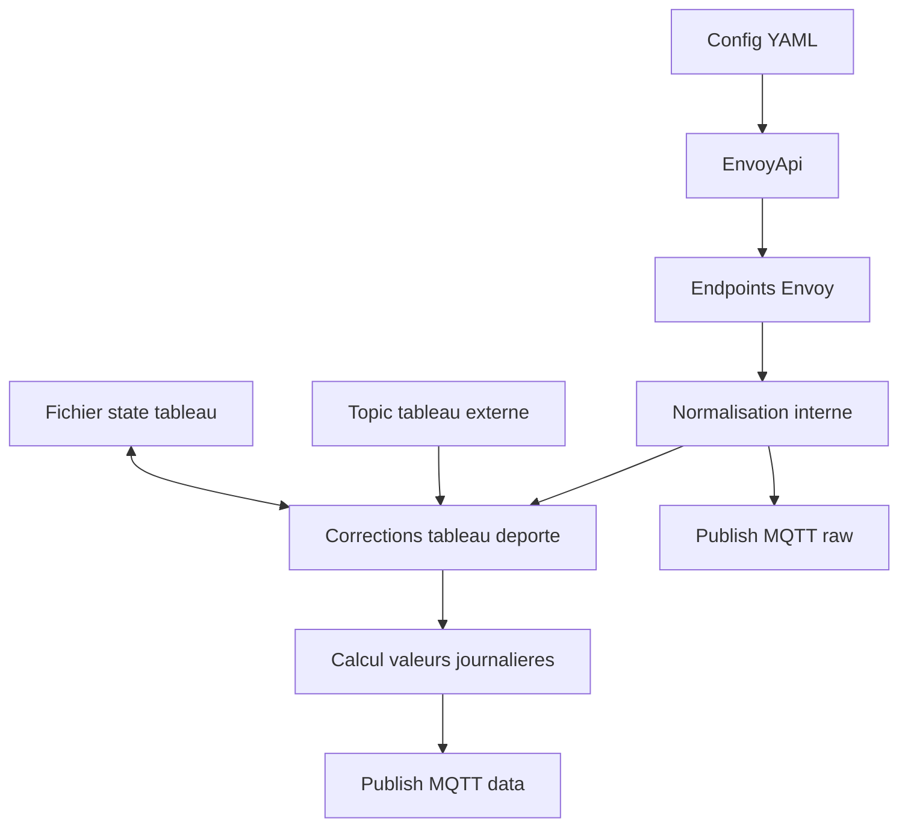

# Pipeline de donnees Envoy

Ce document decrit le flux complet de donnees dans ce projet:

- authentification Enphase
- appels HTTP a la passerelle Envoy
- normalisation et calculs
- integration du tableau electrique deporte via MQTT
- publication MQTT en mode normal et mode haute frequence

## 1. Vue d ensemble

Le service principal lance deux boucles:

- boucle full: lecture complete + calculs + publication retained
- boucle raw (optionnelle): lecture puissance instantanee + publication rapide non retained



## 2. Authentification et securite

Le projet utilise un token bearer Enphase pour les endpoints Envoy.

Sequence:

1. POST https://enlighten.enphaseenergy.com/login/login.json
2. POST https://entrez.enphaseenergy.com/tokens
3. GET /auth/check_jwt sur l Envoy local
4. Reauth automatique si 401

Points importants:

- token considere valide pendant 12h
- timeout cloud: max(8000ms, timeout local)
- timeout local Envoy: config http.timeout_ms
- option insecure TLS possible (certificat auto-signe)

Reference code:

- src/envoyApi.js:1

## 3. Endpoints utilises et formats de retour

### 3.1 GET /ivp/meters

But: recuperer la liste des compteurs et associer eid -> type de mesure.

Le code filtre sur:

- production
- net-consumption

Exemple de retour (simplifie):

```json
[
	{ "eid": 704643328, "measurementType": "production" },
	{ "eid": 704643584, "measurementType": "net-consumption" }
]
```

Resultat interne:

```json
{
	"704643328": "production",
	"704643584": "net-consumption"
}
```

Reference code:

- src/envoyApi.js:229

### 3.2 GET /ivp/meters/readings

But: recuperer les mesures instantanees et cumulees de chaque compteur.

Exemple de retour Envoy (simplifie):

```json
[
	{
		"eid": 704643328,
		"instantaneousDemand": 1260,
		"voltage": 236.2,
		"current": 5.4,
		"pwrFactor": 0.98,
		"actEnergyDlvd": 5581234
	},
	{
		"eid": 704643584,
		"instantaneousDemand": -420,
		"voltage": 235.8,
		"current": -1.8,
		"pwrFactor": -0.94,
		"actEnergyRcvd": 2334455,
		"actEnergyDlvd": 1234567
	}
]
```

Resultat interne apres mapping par role:

```json
{
	"production": { "...": "..." },
	"net-consumption": { "...": "..." }
}
```

Reference code:

- src/envoyApi.js:250

### 3.3 GET /ivp/meters/reports/consumption

But: recuperer les cumuls de consommation (total/net).

Exemple de retour Envoy (simplifie):

```json
[
	{
		"reportType": "total-consumption",
		"cumulative": {
			"currW": 1860,
			"rmsCurrent": 8.2,
			"rmsVoltage": 236.0,
			"whDlvdCum": 9123456
		}
	},
	{
		"reportType": "net-consumption",
		"cumulative": {
			"whDlvdCum": 6789012
		}
	}
]
```

Resultat interne:

```json
{
	"total-consumption": { "currW": 1860, "rmsCurrent": 8.2, "rmsVoltage": 236.0, "whDlvdCum": 9123456 },
	"net-consumption": { "whDlvdCum": 6789012 }
}
```

Reference code:

- src/envoyApi.js:271

### 3.4 GET /api/v1/production

But: recuperer notamment wattHoursToday.

Exemple de retour utile:

```json
{
	"wattHoursToday": 12450
}
```

Reference code:

- src/envoyApi.js:286

## 4. Objets de sortie internes

### 4.1 Sortie getRawData

Objet compact pour la boucle haute frequence:

```json
{
	"conso_all_eim_wNow": 1860,
	"conso_net_eim_wNow": -420,
	"prod_eim_wNow": 1260,
	"timestamp": 1720000000
}
```

Reference code:

- src/envoyApi.js:291

### 4.2 Sortie getAllEnvoyData

Objet complet pour la boucle principale:

- puissances instantanees
- tensions/courants/facteur de puissance
- compteurs lifetime Wh et kWh
- timestamp et timestamp_text

Exemples de champs produits:

- prod_eim_wNow
- conso_net_eim_wNow
- conso_all_eim_wNow
- grid_eim_wNow
- eco_eim_wNow
- prod_eim_whLifetime / prod_eim_kwhLifetime
- conso_net_eim_whLifetime / conso_net_eim_kwhLifetime
- conso_all_eim_whLifetime / conso_all_eim_kwhLifetime

Reference code:

- src/envoyApi.js:304

## 5. Logique de calcul metier

### 5.1 Calculs derives de base

A partir de la puissance nette:

- grid_eim_wNow = abs(netDemand) si netDemand < 0 sinon 0
- grid_eim_wNow_binary = 1 si netDemand > 0 sinon 0
- eco_eim_wNow = prodDemand + netDemand si netDemand < 0 sinon prodDemand

Economie lifetime:

- eco_eim_whLifetime = prod_eim_whLifetime - grid_eim_whLifetime

Reference code:

- src/envoyApi.js:318

### 5.2 Valeurs journalieres

Le service maintient une reference minuit pour:

- conso_all_eim_whLifetime
- conso_net_eim_whLifetime
- prod_eim_whLifetime
- grid_eim_whLifetime
- eco_eim_whLifetime

Et publie:

- sensor_today = current_lifetime - reference_00h
- sensor_yesterday lors du passage a minuit

Reference code:

- src/mqttService.js:397
- src/mqttService.js:597

## 6. Integration du tableau electrique deporte

Configuration:

- sensors.tableau_elec.topic
- sensors.tableau_elec.power_field
- sensors.tableau_elec.index_field
- sensors.tableau_elec.index_unit: kwh | wh | auto
- sensors.tableau_elec.sign: 1 ou -1
- sensors.tableau_elec.state_file

### 6.1 Format de payload accepte

Exemple type Zigbee2MQTT:

```json
{
	"power": 7200,
	"energy": 1345.231
}
```

Regles:

- power_field alimente la correction instantanee (W)
- index_field alimente la correction energie (differentiel d index)
- la premiere valeur d index est baseline, jamais ajoutee telle quelle

### 6.2 Persistance entre redemarrages

Le fichier state_file (par defaut data/tableau-elec-state.json) stocke:

```json
{
	"version": 1,
	"updatedAt": "2026-07-19T12:34:56.000Z",
	"lastIndexWh": 1345231,
	"energyFromIndexWh": 5420
}
```

Mise a jour du fichier:

- a la premiere baseline
- a chaque delta valide
- en cas de recul index (reset/rollover)
- a l arret du service

Reference code:

- src/mqttService.js:136
- src/mqttService.js:178
- src/mqttService.js:648

### 6.3 Corrections appliquees dans le code (detail)

Le principe est bien celui que tu decris: le tableau deporte sert a corriger un ecart sur les donnees Envoy.

Le code applique les corrections suivantes.

Correction puissance instantanee (avec signe):

- signedPowerW = tableau_elec_power * sign
- conso_net_eim_wNow = conso_net_eim_wNow_envoy + signedPowerW
- conso_all_eim_wNow = conso_all_eim_wNow_envoy + signedPowerW

Puis recalcul de derivees instantanees:

- grid_eim_wNow
- grid_eim_wNow_binary
- eco_eim_wNow
- conso_net_eim_current (via I = P / U)

Correction energie cumulative (Wh) via index differentiel uniquement:

- energyOffsetWh = somme des deltas d index externe (jamais la valeur absolue)
- conso_net_eim_whLifetime = conso_net_eim_whLifetime_envoy + energyOffsetWh
- conso_net_eim_kwhLifetime = conso_net_eim_kwhLifetime_envoy + energyOffsetWh / 1000
- conso_all_eim_whLifetime = conso_all_eim_whLifetime_envoy + energyOffsetWh
- conso_all_eim_kwhLifetime = conso_all_eim_kwhLifetime_envoy + energyOffsetWh / 1000
- grid_eim_whLifetime = grid_eim_whLifetime_envoy - energyOffsetWh
- grid_eim_kwhLifetime = grid_eim_kwhLifetime_envoy - energyOffsetWh / 1000
- eco_eim_whLifetime = prod_eim_whLifetime - grid_eim_whLifetime_corrige
- eco_eim_kwhLifetime = prod_eim_kwhLifetime - grid_eim_kwhLifetime_corrige

Impact sur les calculs journaliers:

- conso_all_eim_today, conso_net_eim_today, grid_eim_today et eco_eim_today sont corriges,
  car calcules depuis les lifetimes corriges.

References code:

- src/mqttService.js:679
- src/mqttService.js:684
- src/mqttService.js:706
- src/mqttService.js:724

## 7. Mode haute frequence

Activation:

- high_frequency.enabled: true
- high_frequency.interval_ms: ex 1000

Comportement:

- boucle raw qui appelle getRawData
- publication sur base/serial/raw/field
- messages non retained
- correction puissance tableau appliquee en temps reel
- pas de recalcul journalier dans cette boucle

Reference code:

- src/mqttService.js:342

## 8. Topics MQTT publies

### 8.1 Etat service

- base/serial/lwt: online|offline (retained)

### 8.2 Donnees full

- base/serial/data/field (retained)
- base/serial/data/*_00h (retained)
- base/serial/data/*_today (retained)
- base/serial/data/*_yesterday (retained)

### 8.3 Donnees raw

- base/serial/raw/field (non retained)

### 8.4 Capteurs JSON dedies

- topic pv_production: energy, power, facteur_de_puiss, voltage, current
- topic conso_net: energy, energy_flow, power_cons, power, facteur_de_puiss, voltage, current

Reference code:

- src/ha/energySensors.js:38

## 9. Cas limites et garanties

- Si index_field absent: correction energie externe desactivee (offset = 0)
- Si index recule fortement: delta ignore puis baseline mise a jour
- Si erreur endpoint: la boucle continue, warning logge
- Si token expire/401: reauth + retry automatique

## 10. Checklist d integration Docusaurus

1. Conserver le frontmatter du fichier.
2. Ajouter ce document dans la sidebar Docusaurus.
3. Lier cette page depuis la doc de configuration.
4. Optionnel: ajouter une page annexe avec exemples reels de payload Envoy.

